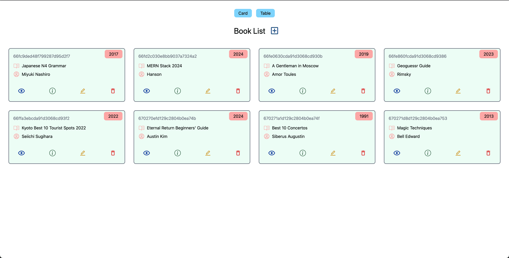
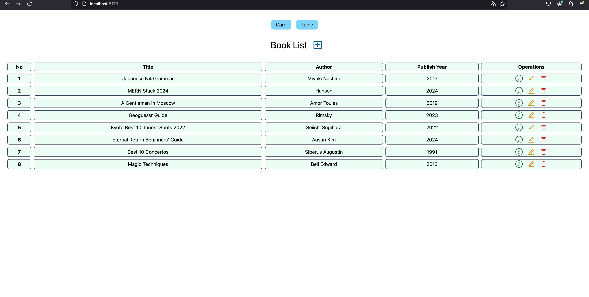
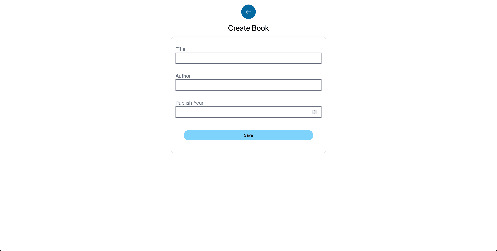
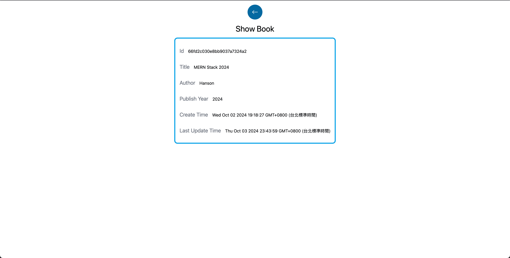
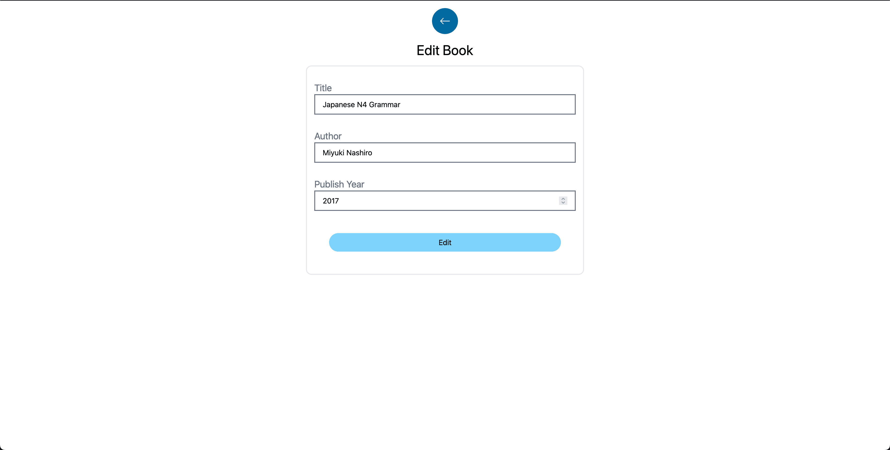
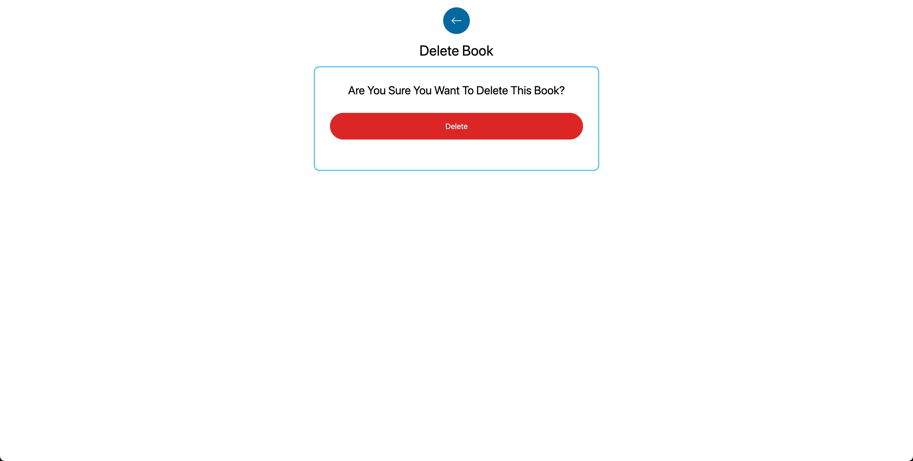
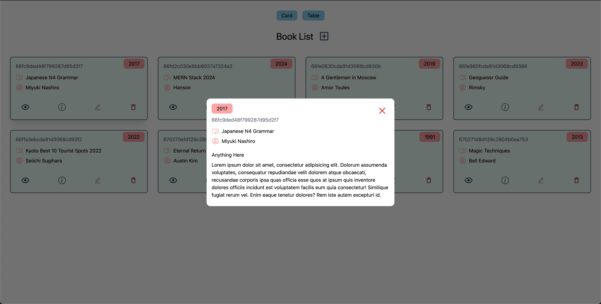

# 書籍清單 MERN 專案實作

### 這是一個可供使用者進行書籍的增刪查改的網站，後端使用 MongoDB, Express.js 及 Node.js 實作書籍資訊的資料庫型態以及伺服器的路由，提供前端來做存取；前端則是使用 Vite + React 來啟動 React 專案，另外 CSS 則是使用 Tailwind CSS 框架進行 inline styling 實作。

#### 首頁畫面：首頁上方可供使用者選擇書籍清單的陳列方式，預設為 Card，即為字卡型態；Table 則是列表型態。

#### 增加書籍：點擊 Bool List 旁邊的加號可以進入填寫書籍資料的頁面，使用者需要輸入書籍的書名、作者和出版年份。按下儲存後，頁面將被自動導回首頁。

#### 查看書籍：點擊每本書的 i(information)圖標，即可切換到 Show Book 頁面，此頁面會列出此書籍的 id、書名、作者、出版年份以及第一次和最後一次編輯的時間。

#### 編輯書籍：點擊每本書的編輯圖標，即可切換到 Edit Book 頁面，此頁面與 Create Book 頁面相似，可以對已存在的書籍進行編輯。

#### 刪除書籍：點擊每本書的垃圾桶圖標，會切換到 Delete Book 頁面，做二次確認使用者是否要刪出該書本。

#### 在字卡型態時，還可以點擊每本書的眼睛符號，會出現該書籍的互動頁面(Modal)，顯示詳細資料。

### 本專案學習到的新技術：

1. 後端使用 Node.js 開發環境、Express.js 建立伺服器及 CRUD 路由操作資料庫以及使用 MongoDB 建立資料庫。
2. 使用 Vite build tool 建立 React 專案。
3. 前端使用 Axios 套件對後端伺服器發出 GET、POST、PUT、DELETE 的請求。
4. 使用 Tailwind CSS 框架進行畫面的樣式設定及 RWD 設定。
5. 使用 Notistack 美化成功與失敗的 Alert。
6. 使用 React Router Dom 實現頁面切換 Page Routes。
